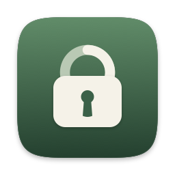
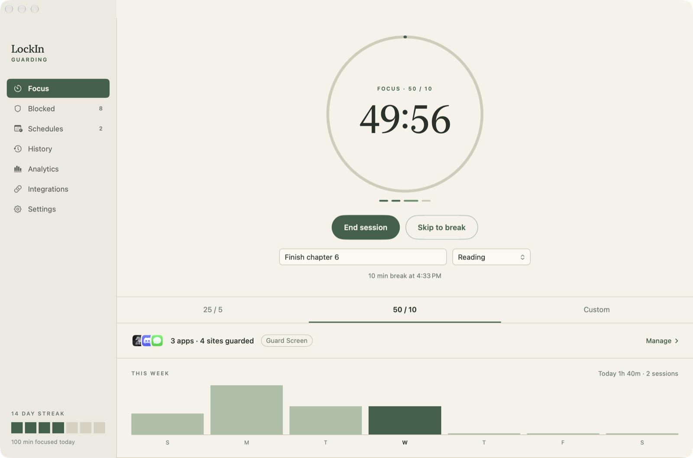
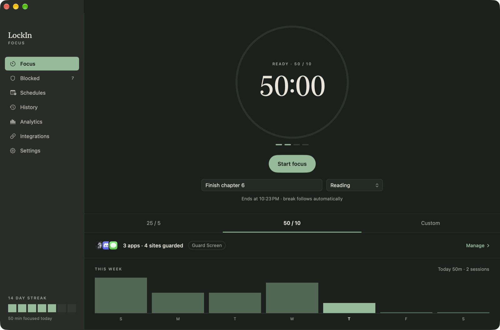
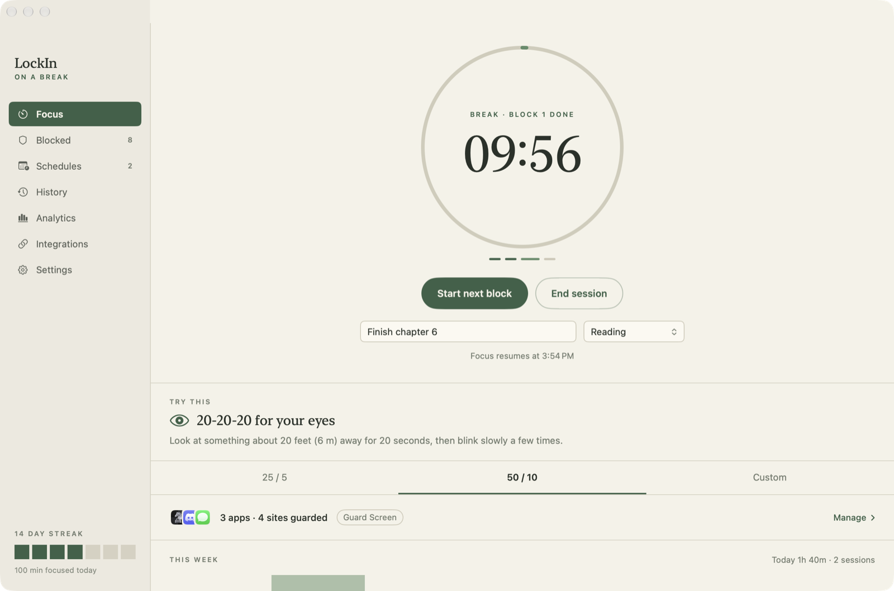

<p align="center">
  
</p>

<h1 align="center">LockIn</h1>

<p align="center">
  <strong>Your friends are on the call. LockIn lets you stay.</strong><br>
  A native macOS focus app that guards apps and websites during focus blocks, without ending your Discord call.
</p>

<p align="center">
  <a href="https://www.orlandoascanio.com/products/lockin">Website and demo video</a> ·
  macOS 14+ · Swift, SwiftUI, AppKit · MIT
</p>



| Dark mode | A break, with something to do |
|---|---|
|  |  |

LockIn lives in the menu bar and runs focus and break blocks. When you open a guarded app during focus, **Guard Screen** hides it and shows a full-screen "Not now." The app keeps running in the background, so a Discord call can carry on. 

No account, no internet, no cloud. Slack and Discord are opt-in and talk only to Slack and Discord.

> **Status:** early build. There is no signed download yet; build it from source below.

## Features

- **Focus and break timer** with `25 / 5`, `50 / 10`, and custom durations, a goal and category per block, and a check-in on each break.
- **Guarded apps**: Guard Screen, Hide Only, or Quit App, set globally or per app.
- **Guarded websites**, without a browser extension (see below).
- **Strict mode**: a block you can't back out of.
- **Schedules**: focus that starts itself, such as weekdays from 9:00 to 12:00.
- **Global keyboard shortcuts** to start, stop, and skip from any app.
- **Break suggestions**: stretch, water, 20-20-20 for your eyes, a walk, and more.
- **Autopilot**: if a finished break goes unanswered, LockIn takes the screen back, counts down, and starts the next block.
- **Widget** for the desktop and Notification Center.
- **Shortcuts actions and a Focus filter**.
- **Slack status and Discord** presence and recaps.
- **Light and dark appearance**, following macOS or your own choice.
- **History and analytics**, a floating HUD, and **Sparkle auto-updates** in release builds.

## Websites

Add sites on **Blocked › Websites**, either a whole site (`youtube.com`, which covers `m.youtube.com` too) or a section (`reddit.com/r/all`). Pasting a full link blocks its whole site.

During focus, while a supported browser is frontmost, LockIn asks it for the current tab's address about once a second through Apple Events. If the address is guarded, LockIn replaces the page with its own "Not now" page. LockIn never reads page contents or history. There's no extension, no `/etc/hosts` edit, and no network filter.

Works in Safari, Chrome, Arc, Brave, Edge, Vivaldi, Opera, and Chromium. macOS asks once per browser whether LockIn may control it. If you said no, the Websites tab shows a link to **Privacy & Security › Automation**. Firefox has no scripting access to its tabs, so it can't be covered this way.

## Strict mode

Turn it on for every block in **Settings › Strict mode**, or per schedule. During a strict focus block:

- **End**, **Skip**, and **Allow 5 minutes** are gone from the guard screen, the HUD, the menu bar, the shortcuts, Shortcuts actions, and the widget.
- You can add to the Blocked list but not remove from it, switch anything off, or loosen the guarding behavior.
- **Quitting is refused**, whether from ⌘Q, the Dock, or a script. Logging out, restarting, or shutting down still works, and the block picks up afterwards if there's time left.
- **If LockIn is force-quit, it reopens and carries on.** A small launch agent in `~/Library/LaunchAgents` runs only while a strict block is active and relaunches LockIn if it disappears. LockIn removes the agent when nothing can start a strict block any more.

The **emergency exit** asks you to type a sentence exactly, then waits (2 minutes by default). The block is logged as cancelled. Breaks are never strict.

## Schedules

Create them on the **Schedules** page: pick days, a start and end time (overnight windows work), and optionally make them strict. Inside a window, each break rolls straight into the next block. Stopping a session skips the rest of that window, and the next window starts as normal. A block still running when the window closes gets to finish.

Schedules only run while LockIn is open, so turn on **Open LockIn at login** (in Settings, or from the prompt on the Schedules page).

## Keyboard shortcuts

These work from any app and need no Accessibility permission. Change them in **Settings › Keyboard shortcuts**.

| Action | Default |
|---|---|
| Start focus | ⌃⌥⌘S |
| Stop session | ⌃⌥⌘E |
| Skip to next phase | ⌃⌥⌘N |

Skip ends focus early and starts the break. The block is logged with the minutes you actually worked, and under a minute counts as cancelled. During a break, skip starts the next block.

## Break suggestions

Each break suggests one thing to do: rest your eyes (20-20-20), drink water, stretch, walk (on breaks of 5 minutes or more), breathe, or reset your posture. The suggestion appears in the break notification, on the Focus page, and in the HUD. Choose which kinds appear in Settings. There's also an optional silent 20-20-20 reminder every 20 minutes inside long focus blocks.

## Widget

Add it from the desktop's **Edit Widgets** menu or from Notification Center. It comes in small and medium sizes and shows the time left (live), your goal, today's focus, your streak, the week, and the next schedule. Its button starts, stops, or skips. During a strict block it shows **Locked** instead.

## Shortcuts and Focus modes

LockIn adds **Start Focus** (with optional minutes and strict), **Stop Focus**, **Skip to Next Phase**, and **Get Focus Status** to the Shortcuts app and Spotlight.

To tie LockIn to a macOS Focus, go to **System Settings › Focus**, pick a Focus, then **Focus Filters › Add Filter › LockIn**. Turn on **Start a focus block**, and optionally **Use strict mode** and **End the block when this Focus turns off**.

## Slack and Discord

Set these up on the **Integrations** page. Secrets are stored in your Keychain, never in `config.json`.

- **Slack**: sets your status to "Focusing · back at 10:45" and pauses notifications for exactly the length of the block. Both are cleared when the block ends, but only if LockIn set them. Needs a user token from a Slack app you create with the `users.profile:write` and `dnd:write` scopes. The page walks you through it.
- **Discord status**: Rich Presence shows "Focusing · 18 min left" on your profile while the Discord desktop app is running. Needs the Application ID of a Discord app you create, named whatever you want your profile to show. LockIn can't change your *custom* status text, because Discord only allows that with your account token, which is against its rules.
- **Discord recap**: when a run of blocks ends, LockIn posts blocks, focus time, categories, and goals to a channel webhook. Mentions are disabled, so a goal containing `@everyone` stays plain text.

## Requirements

- macOS 14 or newer
- Xcode (the app, its widget, and its App Intents build through an Xcode project)
- [XcodeGen](https://github.com/yonaskolb/XcodeGen): `brew install xcodegen`

## Build and run

Run the core tests (timer, persistence, blocking rules, schedules, strict mode, website matching, integrations):

```bash
swift test
```

Build `build/LockIn.app`, signed with your development certificate:

```bash
Scripts/build_app.sh
```

Build it and put it in `/Applications`:

```bash
Scripts/install_app.sh
```

To open the project in Xcode, generate it first. `LockIn.xcodeproj` is generated from `project.yml` and not committed.

```bash
xcodegen generate && open LockIn.xcodeproj
```

To try a build against throwaway data instead of your real settings and history, run it with `LOCKIN_DATA_DIR`:

```bash
LOCKIN_DATA_DIR=/tmp/lockin-test build/LockIn.app/Contents/MacOS/LockIn
```

## Releases

`Scripts/release.sh` archives with Developer ID, builds a DMG, notarizes and staples it, signs it for Sparkle, and writes `appcast.xml`. One-time setup (a Developer ID certificate, notarization credentials, and a Sparkle key) is in [Scripts/release/README.md](Scripts/release/README.md). Builds without a Sparkle key simply have no updater.

## Blocking behavior

LockIn observes macOS app activation events. During focus, if a guarded app becomes active, LockIn reacts immediately.

- **Guard Screen**: hides the app, shows the guard overlay, and lets the app keep running in the background.
- **Hide Only**: hides the app without showing the guard overlay.
- **Quit App**: asks the app to quit. This only happens when selected explicitly.

Guarding only runs during focus. It stops during break, break-ended, idle, completed, and cancelled states.

Protected apps are never hidden or quit and cannot be added: Finder, Dock, System Settings / System Preferences, Terminal, loginwindow, WindowServer, and LockIn itself.

## Storage

LockIn stores everything locally in `~/Library/Application Support/LockIn/`:

- `config.json`: settings, blocked apps and sites, schedules
- `session-state.json`: the running block, if any
- `session-history.jsonl`: one line per block
- `block-activity.json`: today's guard counts

The widget reads a small snapshot in the app-group container (`~/Library/Group Containers/5BVWR47BQX.com.lockin.shared/`). Config and session state use atomic writes. If either becomes invalid, LockIn keeps a timestamped `.invalid-*` copy and recovers with safe defaults. Configs from older builds load as-is, including goals and categories from the old Stream settings.

## Project layout

```text
project.yml          XcodeGen spec for the app and widget targets
Package.swift        FocusLockCore and its tests
FocusLock/
├── App/             AppKit shell, controller, hotkeys, intents, watchdog, updater
├── UI/              SwiftUI pages
├── Widget/          WidgetKit extension
├── Core/            Timer, storage, blocking, website guard, Slack, Discord
├── Models/          Config, sessions, schedules, strict mode, suggestions
├── Supporting/      Info.plist and entitlements (generated from project.yml)
└── Tests/
```

The core logic lives in `FocusLockCore` so timer recovery, persistence, blocking rules, schedules, strict mode, and website matching can be tested without launching the UI.

## Stream mode

The study/work-with-me streaming features (audience window, chat wall, Twitch connection) were removed to keep LockIn focused on solo work. The last version with them is on the `archive/stream` branch and the `stream-final` tag.

## License

[MIT](LICENSE).

## Known limitations

- Website guarding covers the frontmost browser tab in the browsers listed above, not Firefox and not other apps' web views.
- Quit App mode uses normal app termination, not force quit.
- Strict mode is strong friction, not a cage: someone determined can still unload the launch agent from Terminal or restart the Mac.
